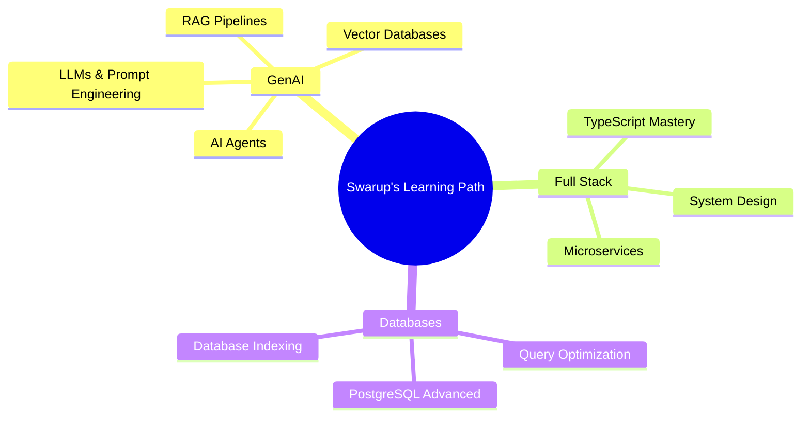

<div align="center">

<!-- Animated Header Banner -->


<!-- Typing SVG -->
<a href="https://git.io/typing-svg">
  
</a>

<br/><br/>

<!-- Social Badges -->
<p>
  <a href="https://linkedin.com/in/swarup-das-cs12101999">
    
  </a>&nbsp;
  <a href="https://www.leetcode.com/swarupdcse">
    
  </a>&nbsp;
  <a href="mailto:swarupd1999@gmail.com">
    
  </a>&nbsp;
  <a href="https://x.com/swarupdcs">
    
  </a>&nbsp;
  
</p>

<br/>

<!-- Availability Badge -->


</div>

---

## 🧑‍💻 About Me

```yaml
┌─────────────────────────────────────────────────────────┐
│                    >> swarup.config.yaml                │
├─────────────────────────────────────────────────────────┤
│  name       : Swarup Das                               │
│  location   : India 🇮🇳                                │
│  role       : Full Stack Developer                     │
│  experience : MERN Stack, TypeScript, GenAI            │
│                                                         │
│  currently  :                                          │
│    - 🔭 Building scalable full-stack apps              │
│    - 🤖 Exploring LLMs, RAG pipelines & AI agents     │
│    - 🧪 Experimenting with vector DBs & embeddings     │
│                                                         │
│  expertise  :                                          │
│    - MERN Stack (MongoDB, Express, React, Node.js)     │
│    - TypeScript (strict mode enthusiast)               │
│    - REST APIs & system design                         │
│    - PostgreSQL, MySQL, MongoDB                        │
│                                                         │
│  available_for : Freelance · Collab · Open Source      │
│  contact       : swarupd1999@gmail.com                 │
└─────────────────────────────────────────────────────────┘
```

<br/>

<table>
<tr>
<td width="50%">

### 🚀 What I'm Up To

- 🔭 Building **scalable MERN applications** with clean architecture
- 🤖 Deep-diving into **Generative AI** — LLMs, RAG pipelines, prompt engineering
- 📐 Mastering **TypeScript** and advanced design patterns
- 🧩 Solving algorithmic problems on **LeetCode**
- 🌍 Contributing to **open-source** communities

</td>
<td width="50%">

### 💡 I Can Help You With

- ⚡ **Full Stack Web Development** (MERN)
- 🔷 **TypeScript** best practices & architecture
- 🗄️ **Database design** — SQL & NoSQL
- 🤖 **AI-powered app** integration (OpenAI, LangChain)
- 🔗 **REST API** design & optimization
- 🛠️ **Code reviews**, pair programming & mentoring

</td>
</tr>
</table>

---

## 🛠️ Tech Stack & Expertise

<div align="center">

### 💻 Programming Languages


---

### 🎨 Frontend Development


---

### ⚙️ Backend Development


---

### 🗄️ Databases


---

### 🤖 GenAI & ML Tools


---

### 🔧 Tools & DevOps


</div>

---

## 📊 GitHub Statistics

<div align="center">


<br/><br/>


&nbsp;&nbsp;


<br/><br/>


</div>

---

## 🏆 GitHub Trophies

<div align="center">
  
</div>

---

## 📈 Contribution Graph

<div align="center">

[](https://github.com/ashutosh00710/github-readme-activity-graph)

</div>

---

## 🧠 Expertise Breakdown

<div align="center">

| Domain | Technologies | Proficiency |
|:---|:---|:---:|
| 🖥️ **Frontend** | React, TypeScript, Tailwind CSS, Redux | ██████████ Expert |
| ⚙️ **Backend** | Node.js, Express.js, REST APIs | █████████░ Advanced |
| 🗄️ **Databases** | MongoDB, PostgreSQL, MySQL | ████████░░ Advanced |
| 🤖 **GenAI** | LLMs, RAG, OpenAI, LangChain | ███████░░░ Growing |
| 🔧 **DevOps** | Git, Linux, CI/CD, Postman | ████████░░ Solid |
| 🧮 **DSA** | Arrays, Trees, DP, Graphs | ████████░░ Solid |

</div>

---

## 🎯 2025 Goals

```
 ✅  Master TypeScript advanced patterns & generics
 ✅  Build production-ready RAG-based AI applications
 🔄  Deep-dive into system design & distributed systems
 🔄  Contribute to high-impact open source projects
 🔄  Build a SaaS product from scratch to launch
 🔲  Earn AWS / GCP cloud certification
 🔲  Publish technical blogs & developer content
```

---

## 📚 Currently Learning

<div align="center">



</div>

---

## 💬 Dev Philosophy

<div align="center">

> *"First, solve the problem. Then, write the code."* — John Johnson

> *"Clean code always looks like it was written by someone who cares."* — Robert C. Martin

> *"Make it work, make it right, make it fast."* — Kent Beck

</div>

---

## 🌐 Connect With Me

<div align="center">

| Platform | Handle | Link |
|:---:|:---:|:---:|
| 💼 LinkedIn | swarup-das-cs12101999 | [Connect →](https://linkedin.com/in/swarup-das-cs12101999) |
| 🐦 X (Twitter) | @swarupdcs | [Follow →](https://x.com/swarupdcs) |
| 🧩 LeetCode | swarupdcse | [View Profile →](https://www.leetcode.com/swarupdcse) |
| 📧 Email | swarupd1999@gmail.com | [Send Mail →](mailto:swarupd1999@gmail.com) |

<br/>

**💬 I'm always happy to chat about tech, collaborate on projects, or just geek out about AI. Don't hesitate to reach out!**

</div>

---

<div align="center">

### 🤝 Open to Opportunities

[](mailto:swarupd1999@gmail.com)
[](https://github.com/swarupcs)

<br/><br/>


<br/>

**"Code is like humor. When you have to explain it, it's bad."** — Cory House

<br/>

⭐️ *If you find my work interesting, consider giving my repos a star! It keeps me motivated.* 🚀

</div>
