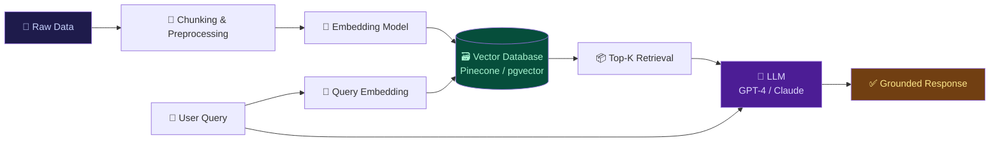
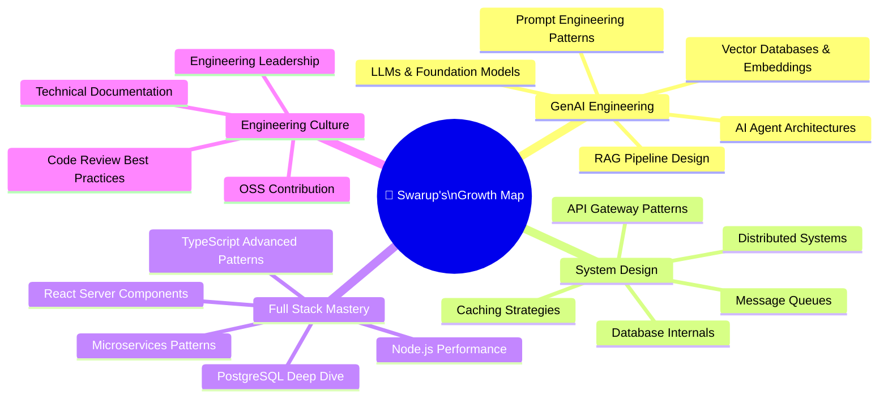

<div align="center">


<br/>

<a href="https://git.io/typing-svg">
  
</a>

<br/><br/>

<p>
  <a href="https://linkedin.com/in/swarup-d">
    
  </a>&nbsp;
  <a href="https://www.leetcode.com/swarupdcse">
    
  </a>&nbsp;
  <a href="mailto:swarupd1999@gmail.com">
    
  </a>&nbsp;
  <a href="https://x.com/swarupdcs">
    
  </a>&nbsp;
  <a href="https://github.com/swarupcs">
    
  </a>
</p>

<p>
  
  &nbsp;
  
  &nbsp;
  
</p>

</div>

---

<div align="center">

```
╔══════════════════════════════════════════════════════════════════════════╗
║                                                                          ║
║     $ whoami                                                             ║
║     > swarup_das — Full Stack Engineer crafting production systems       ║
║                                                                          ║
║     $ cat skills.txt | grep --level=senior                              ║
║     > MERN · TypeScript · PostgreSQL · MongoDB · MySQL · GenAI          ║
║                                                                          ║
║     $ echo $CURRENT_FOCUS                                               ║
║     > Scalable APIs · RAG Pipelines · System Design · Clean Code        ║
║                                                                          ║
║     $ ls ./open-to/                                                      ║
║     > fulltime/  freelance/  collab/  open-source/                      ║
║                                                                          ║
╚══════════════════════════════════════════════════════════════════════════╝
```

</div>

---

## 👤 Engineering Profile

<table>
<tr>
<td width="55%" valign="top">

### 🧠 Who Am I?

I'm a **Full Stack Engineer** from India with deep expertise in the **MERN ecosystem** and a strong focus on writing **clean, type-safe, production-grade code**. I believe software engineering is as much about people and systems as it is about syntax.

My engineering philosophy revolves around three pillars:
- **Correctness first** — code that works before code that's clever
- **Scalability by design** — architect for tomorrow, build for today
- **Developer experience** — clean APIs, readable code, good docs

Currently exploring the frontier of **Generative AI** — building LLM-powered applications, designing RAG pipelines, and integrating AI into real-world products.

> *I write code that other engineers enjoy reading.*

</td>
<td width="45%" valign="top">

### ⚡ Quick Facts

```typescript
const swarup = {
  role: "Full Stack Engineer",
  location: "India 🇮🇳",
  timezone: "IST (UTC+5:30)",

  languages: ["TypeScript", "JavaScript",
              "Python", "Java", "C++"],

  stack: {
    frontend: ["React", "Redux", "Tailwind"],
    backend:  ["Node.js", "Express.js"],
    database: ["PostgreSQL", "MongoDB", "MySQL"],
    ai:       ["LangChain", "OpenAI", "RAG"],
  },

  principles: ["SOLID", "DRY", "YAGNI",
               "Clean Architecture"],

  currentlyLearning: "System Design + GenAI",
  openTo: "Freelance | Full-Time | OSS",
};
```

</td>
</tr>
</table>

---

## 🛠️ Technical Arsenal

<div align="center">

### ◈ Languages


### ◈ Frontend


### ◈ Backend & APIs


### ◈ Databases & Storage


### ◈ GenAI & ML


### ◈ DevOps & Tooling


</div>

---

## 🏗️ Engineering Depth

<div align="center">

| Domain | Core Skills | Depth |
|:---|:---|:---:|
| 🖥️ **Frontend Engineering** | React, TypeScript, Redux Toolkit, Tailwind, Responsive Design | `████████████ 95%` |
| ⚙️ **Backend Engineering** | Node.js, Express.js, RESTful APIs, Auth (JWT/OAuth), Middleware | `███████████░ 90%` |
| 🗄️ **Database Design** | PostgreSQL, MongoDB, MySQL, Schema Design, Indexing, Query Optimization | `█████████░░░ 80%` |
| 🔷 **TypeScript** | Strict Types, Generics, Utility Types, Decorators, Type Guards | `███████████░ 90%` |
| 🤖 **GenAI Engineering** | LLM Integration, RAG Pipelines, Vector DBs, Prompt Engineering | `████████░░░░ 70%` |
| 🏛️ **System Design** | Scalability, Caching, Load Balancing, Microservices, API Design | `████████░░░░ 70%` |
| 🧮 **DSA & CS Fundamentals** | Algorithms, Data Structures, Complexity Analysis, LeetCode | `████████░░░░ 75%` |
| 🔧 **DevOps & Infrastructure** | Docker, GitHub Actions, Linux, CI/CD Pipelines, Deployment | `███████░░░░░ 65%` |

</div>

---

## 📊 GitHub Intelligence

<div align="center">


<br/><br/>


&nbsp;


<br/><br/>


<br/><br/>


&nbsp;

&nbsp;


</div>

---

## 🏆 Achievements & Trophies

<div align="center">
  
</div>

---

## 📈 Contribution Activity

<div align="center">

[](https://github.com/ashutosh00710/github-readme-activity-graph)

</div>

---

## 🧩 How I Engineer

<div align="center">

```
┌─────────────────────────────── MY ENGINEERING APPROACH ────────────────────────────────────┐
│                                                                                              │
│   📋 UNDERSTAND          🧪 DESIGN            🛠️ BUILD             🚀 SHIP                  │
│   ─────────────          ────────             ───────             ────────                  │
│   • Define the           • Plan the           • Write clean,      • Review &                │
│     problem clearly        architecture         typed code          test thoroughly         │
│   • Gather all           • Choose right       • Apply SOLID       • Document APIs           │
│     requirements           data structures      principles          & decisions             │
│   • Identify edge        • Design APIs        • Write tests       • Deploy with             │
│     cases first            upfront              & validate          CI/CD pipelines         │
│   • Clarify              • Think about        • Handle errors     • Monitor &               │
│     constraints            scalability          gracefully          iterate fast            │
│                                                                                              │
└──────────────────────────────────────────────────────────────────────────────────────────────┘
```

</div>

---

## 🤖 GenAI Engineering Focus

<div align="center">



**↑ RAG Pipeline architecture I design and build**

</div>

<br/>

<table>
<tr>
<td width="33%" align="center">

**🔗 LLM Integration**

Connecting OpenAI, Anthropic & OSS models into production apps with proper rate limiting, fallbacks & streaming responses.

</td>
<td width="33%" align="center">

**🗂️ Vector Databases**

Designing embedding pipelines with Pinecone, pgvector & ChromaDB for semantic search at scale.

</td>
<td width="33%" align="center">

**🧠 Prompt Engineering**

Crafting system prompts, few-shot examples & chain-of-thought patterns for reliable, grounded AI outputs.

</td>
</tr>
</table>

---

## 💼 What I Bring to a Team

<div align="center">

<table>
<tr>
<td align="center" width="25%">

### 🏗️
**Architecture**

I think in systems, not features. I design APIs, data models & service boundaries before writing line one.

</td>
<td align="center" width="25%">

### 🔷
**Type Safety**

TypeScript-first, strict mode always. If the compiler catches it, your users won't have to.

</td>
<td align="center" width="25%">

### 📖
**Readability**

Code is read 10× more than it's written. I write for the next engineer, not just the machine.

</td>
<td align="center" width="25%">

### 🚀
**Delivery**

I ship. Not perfect code — *good* code that solves real problems, iterates fast, and moves the needle.

</td>
</tr>
<tr>
<td align="center">

### 🧪
**Testing**

Unit, integration & e2e. I treat tests as living documentation and a safety net, not an afterthought.

</td>
<td align="center">

### 🤝
**Collaboration**

Clear communicator. PRs with context, reviews that teach, questions that unblock.

</td>
<td align="center">

### 🔍
**Debugging**

Methodical root-cause finder. I read logs, trace errors & fix causes — not just suppress symptoms.

</td>
<td align="center">

### 📈
**Growth**

I learn every day. New patterns, papers, tools. I bring fresh ideas while respecting proven solutions.

</td>
</tr>
</table>

</div>

---


</div>

---

## 📚 Learning Radar

<div align="center">



</div>

---

## 💬 Engineering Philosophy

<div align="center">

<br/>

> ### *"Make it work. Make it right. Make it fast."*
> — Kent Beck

<br/>

> ### *"Programs must be written for people to read, and only incidentally for machines to execute."*
> — Harold Abelson, SICP

<br/>

> ### *"The best code is no code at all."*
> — Jeff Atwood

<br/>

> ### *"Simplicity is the soul of efficiency."*
> — Austin Freeman

<br/>

</div>

---

## 🔢 Fun Developer Stats

<div align="center">

| Metric | Value |
|:---|:---:|
| ☕ Cups of coffee per feature | `∞` |
| 🐛 Bugs introduced this week | `git blame says otherwise` |
| 📦 node_modules size | `heavier than a black hole` |
| 💡 Stack Overflow tabs open | `always 12+` |
| 🎯 LeetCode problems solved | `growing daily` |
| 📝 TypeScript strictness level | `strict: true, always` |
| 🔁 Commit message quality | `feat: actually meaningful` |
| ⏰ Time in VS Code today | `¯\_(ツ)_/¯` |

</div>

---

## 🌐 Let's Connect & Build Together

<div align="center">

<br/>

| Platform | Handle | Purpose |
|:---:|:---:|:---:|
| 💼 **LinkedIn** | [swarup-das-cs12101999](https://linkedin.com/in/swarup-das-cs12101999) | Professional network & opportunities |
| 🐦 **X (Twitter)** | [@swarupdcs](https://x.com/swarupdcs) | Tech thoughts & dev updates |
| 🧩 **LeetCode** | [swarupdcse](https://www.leetcode.com/swarupdcse) | DSA grind & problem solving |
| 📧 **Email** | [swarupd1999@gmail.com](mailto:swarupd1999@gmail.com) | Direct collaboration |
| 💻 **GitHub** | [swarupcs](https://github.com/swarupcs) | Code, projects & OSS |

<br/>

**Open to:** Full-Time Roles &nbsp;•&nbsp; Freelance Projects &nbsp;•&nbsp; Technical Consulting &nbsp;•&nbsp; Open Source Collaboration

<br/>

[](mailto:swarupd1999@gmail.com)
&nbsp;
[](https://linkedin.com/in/swarup-das-cs12101999)
&nbsp;
[](https://www.leetcode.com/swarupdcse)

</div>

---

<div align="center">


<br/>

**⭐ If my work resonates with you — a star on my repos goes a long way. Let's build great software together. 🚀**

<br/>

*Last updated: 2026 · Crafted with caffeine, curiosity & a relentless love for clean code.*

</div>
